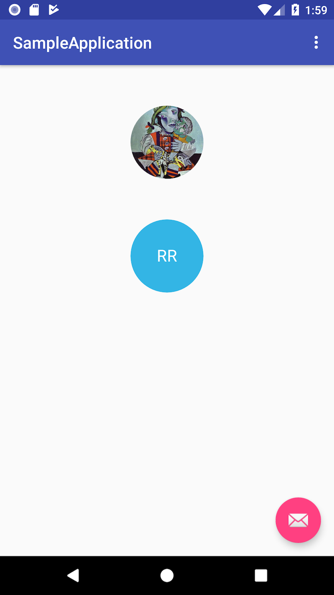

# NameInitialsCircleImageView
A circle image view that not only supports showing circular images but also supports showing name initial letters with a background color in case there is no image available, just like the Gmail Android app.

 

It is just a custom view and you can use it just like you use any native Android views.

**XML**

```
<com.github.ramiz.nameinitialscircleimageview.NameInitialsCircleImageView
        android:id="@+id/initialsCircleImageView"
        android:layout_width="90dp"
        android:layout_height="90dp"
        android:layout_marginTop="50dp"
        app:text="RR"
        app:textSize="20sp"/>
```

**Java**

```
NameInitialsCircleImageView nameInitialsImageView = findViewById(...)
nameInitialsImageView.setImageUrl("http://i.imgur.com/DvpvklR.png")
nameInitialsImageView.setCircleBackgroundColorResource(android.R.color.holo_blue_light)
nameInitialsImageView.setText("RR")
```

**Kotlin**

```
val nameInitialsImageView = findViewById<NameInitialsCircleImageView>(R.id.initialsCircleImageView)
nameInitialsImageView.setImageUrl("http://i.imgur.com/DvpvklR.png")
nameInitialsImageView.setText("RR")
nameInitialsImageView.setCircleBackgroundColorResource(android.R.color.holo_blue_light)
```